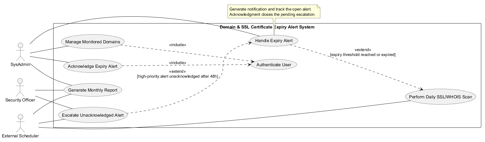

# Lab 1: Requirements Engineering & UML Use-Case Modelling

**Sujay Hegde | PES1UG24CS478 | PES University**
**BPS #47:** Domain & SSL Certificate Expiry Alert System

An IT operations utility performs daily WHOIS and SSL/TLS expiry checks and warns SysAdmins before assets expire. Security Officers receive escalations for unacknowledged high-priority alerts.

| Deliverable | File |
| --- | --- |
| Exactly five FRs and two NFRs | [Requirements table](Requirements.md) |
| Requirements traceability matrix | [RTM table](RTM_Table.md), [PDF](RTM_Table.pdf) |
| UML use-case diagram with include and extend | [Diagram and PlantUML source](UseCaseDiagram.md), [PNG](Use_Case_Diagram.png) |
| One-page core use-case flow, including one alternate | [Markdown](UseCaseSpecification.md), [PDF](UseCaseSpecification.pdf) |
| Assigned scenario | [Problem statement PDF](47_SE_Lab1_SE_Problem_Statements.pdf) |

The external scheduler starts daily scans and checks escalation deadlines. Expiry alert handling conditionally extends the scan, and escalation conditionally extends the active alert lifecycle. Authentication is included in protected user operations.
