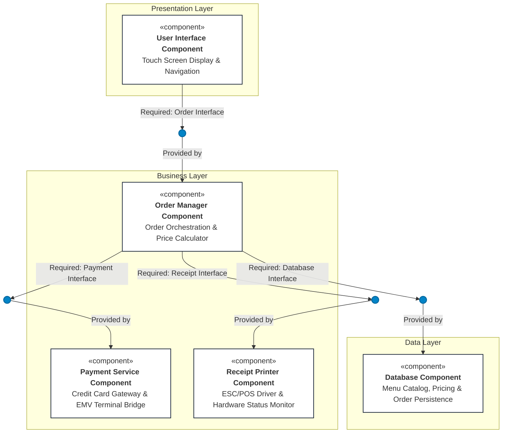

# Architectural Specification & Design Document

**Course:** Software Engineering Lab (UE24CS252AA) — Lab 3  
**Title:** Component Modelling & Architectural Pattern Selection  
**Assigned System:** Self-Service Coffee Kiosk System  
**Student:** Sujay Hegde | **SRN:** PES1UG24CS478 | **Section:** 4-H  
**Institution:** PES University, Department of Computer Science & Engineering  

---

## 1. Scenario Review & Requirements Analysis

### 1.1 Assigned Scenario
A Self-Service Coffee Kiosk system deployed in a busy café to provide an autonomous, rapid, and frictionless coffee ordering experience.

### 1.2 Core Functional Requirements
- **FR-1 (Coffee Selection):** The system must allow customers to select from exactly three coffee types: **Espresso**, **Americano**, and **Latte**.
- **FR-2 (Drink Size Customization):** The system must allow customers to select from two drink sizes: **Small** and **Large**, with dynamic price adjustment.
- **FR-3 (Credit Card Payment):** The system must accept payments exclusively via **credit card** (no cash or NFC wallets permitted per kiosk spec).
- **FR-4 (Receipt Generation):** The system must print a physical paper receipt with itemized order details (order ID, item, size, subtotal, tax, timestamp, card authorization code).

### 1.3 Technical Constraints
- **TC-1 (Touch Screen Interface):** Must handle responsive touch screen events with intuitive kiosk UI navigation.
- **TC-2 (Hardware Printer Connectivity):** Must connect directly to physical receipt printer hardware via hardware drivers (ESC/POS serial/USB interface).
- **TC-3 (Menu & Pricing Data Store):** Must store and retrieve menu catalog, size modifiers, pricing tables, and transaction logs.

### 1.4 Non-Functional Requirements & Key Challenges
- **Performance:** Instantaneous touch response (<50ms) and rapid end-to-end checkout to prevent queue accumulation during morning café rush hours.
- **Usability:** High-contrast, intuitive touchscreen flow accessible to all customers without barista intervention.
- **Security:** Strict PCI-DSS compliance; complete physical and logical isolation of credit card data buffers; no plaintext card data stored locally.
- **Reliability:** Deterministic hardware error handling (e.g., out-of-paper detection, card terminal timeout) with graceful kiosk recovery.

---

## 2. Architectural Style Analysis

| Architectural Style | Structure & Characteristics | Scenario Pros | Scenario Cons | Verdict |
| :--- | :--- | :--- | :--- | :---: |
| **Layered Architecture** | Organized into horizontal logical layers: Presentation, Business Logic, and Data Access. | • Clear separation of concerns<br/>• Hardware device abstraction<br/>• Zero network latency (in-process IPC)<br/>• Simple, robust local kiosk deployment | • Components are co-located on single host<br/>• Monolithic binary updates | **SELECTED (Optimal)** |
| **Microservices Architecture** | Distributed collection of fine-grained, independently deployable network services. | • Independent service scaling<br/>• Technology heterogeneity | • Massive operational overhead for a single kiosk<br/>• High network latency & serialization overhead<br/>• Complex distributed failure modes | **REJECTED** |
| **Client-Server Architecture** | Centralized backend server hosting logic/data with remote kiosk thin clients. | • Centralized catalog updates across multiple cafés | • Kiosk halts completely if café internet disconnects<br/>• Single point of network failure at checkout | **REJECTED** |

---

## 3. Architecture Selection & Justification

### Mandatory Architecture Selection Statement
> **"We chose Layered Architecture for the Self-Service Coffee Kiosk System."**

### 3.1 Two Specific Scenario-Related Reasons
1. **Hardware Modularity & Peripheral Isolation:** The kiosk couples directly to physical hardware peripherals (touchscreen monitor, EMV credit card reader, thermal receipt printer). Layered architecture encapsulates device drivers into discrete business/hardware components. If café management updates printer hardware or display resolutions, only the respective component driver is touched—core order logic and pricing schemas remain untouched.
2. **Elimination of Distributed Overhead for an Autonomous Terminal:** A coffee kiosk is an embedded, single-station kiosk where orders are placed sequentially by physical customers. Microservices or remote client-server models introduce network failure points, serialization delays, and distributed transaction complexity. Layered architecture enables direct, sub-millisecond local in-process calls ensuring instantaneous checkout during peak café rushes.

### 3.2 Security Advantage
- **PCI-DSS Enclave & Layer Isolation:** All credit card interactions are encapsulated within the **Payment Service Component**. The Presentation Layer (touch screen) has zero direct access to memory structures holding cardholder data or the persistent database. Sensitive authorization runs through the isolated `Payment Interface` directly communicating with encrypted EMV terminal hardware, dramatically reducing PCI compliance audit scope and eliminating touch-screen memory snooping vulnerabilities.

### 3.3 Performance Benefit
- **Zero Network Latency & Boot-Time In-Memory Caching:** All components communicate through local IPC or direct in-memory method invocations rather than network hops. Menu data (Espresso, Americano, Latte) and pricing matrices are loaded from the **Database Component** into local memory caches at startup, guaranteeing instantaneous touch responsiveness (<10ms) and immediate receipt dispatch.

---

## 4. Component Identification & Interface Specifications

### 4.1 Identified System Components (5 Components)

1. **User Interface Component (`<<component>>`) — Presentation Layer**
   - **Role:** Handles customer touch screen interactions, renders drink selection screens (Espresso, Americano, Latte), size toggles (Small, Large), payment status, and order completion screens.
   - **Required Interface:** `Order Interface` (Socket)

2. **Order Manager Component (`<<component>>`) — Business Layer**
   - **Role:** Central domain orchestrator; maintains order state machine; computes total cost based on drink and size; triggers card payment; directs receipt printing; and persists completed order records.
   - **Provided Interface:** `Order Interface` (Ball)
   - **Required Interfaces:** `Payment Interface` (Socket), `Receipt Interface` (Socket), `Database Interface` (Socket)

3. **Payment Service Component (`<<component>>`) — Business Layer**
   - **Role:** Hardware bridge to the physical EMV card reader terminal; enforces Credit Card Only policy; manages point-to-point encryption (P2PE) and tokenized authorization requests.
   - **Provided Interface:** `Payment Interface` (Ball)

4. **Receipt Printer Component (`<<component>>`) — Business Layer (Hardware Abstraction)**
   - **Role:** Communicates directly with the physical thermal receipt printer using ESC/POS protocol; formats itemized receipts (coffee type, size, price, order ID, timestamp); monitors printer paper and hardware status.
   - **Provided Interface:** `Receipt Interface` (Ball)

5. **Database Component (`<<component>>`) — Data Layer**
   - **Role:** Local relational storage engine (SQLite / JDBC); stores menu items, drink sizes, base prices, tax rules, and transactional order histories.
   - **Provided Interface:** `Database Interface` (Ball)

---

### 4.2 Interface Specifications (4 UML Ball & Socket Interfaces)

```
+----------------------------------------------------------------------------------------------------+
| 1. Order Interface                                                                                 |
|    Provided by: Order Manager Component (Ball)                                                     |
|    Required by: User Interface Component (Socket)                                                  |
|    Protocol: Local IPC / Direct Method Invocation                                                  |
|    Operations:                                                                                     |
|      • selectCoffee(coffeeType: Enum[Espresso, Americano, Latte], size: Enum[Small, Large]): Order |
|      • calculateTotal(orderId: String): Decimal                                                    |
|      • submitOrder(orderId: String): TransactionStatus                                             |
|      • cancelOrder(orderId: String): Boolean                                                       |
+----------------------------------------------------------------------------------------------------+
| 2. Payment Interface                                                                               |
|    Provided by: Payment Service Component (Ball)                                                   |
|    Required by: Order Manager Component (Socket)                                                   |
|    Protocol: Encrypted Hardware Terminal API / PCI SDK                                             |
|    Operations:                                                                                     |
|      • processPayment(orderId: String, amount: Decimal): PaymentResult                             |
|      • authorizeCard(): CardAuthToken                                                              |
|      • cancelTransaction(): Void                                                                   |
+----------------------------------------------------------------------------------------------------+
| 3. Receipt Interface                                                                               |
|    Provided by: Receipt Printer Component (Ball)                                                   |
|    Required by: Order Manager Component (Socket)                                                   |
|    Protocol: ESC/POS Thermal Printer Driver (USB / RS-232)                                         |
|    Operations:                                                                                     |
|      • printReceipt(orderDetails: ReceiptPayload): PrintStatus                                     |
|      • checkPrinterStatus(): PrinterHealth[READY, OUT_OF_PAPER, JAMMED, OFFLINE]                   |
+----------------------------------------------------------------------------------------------------+
| 4. Database Interface                                                                              |
|    Provided by: Database Component (Ball)                                                          |
|    Required by: Order Manager Component (Socket)                                                   |
|    Protocol: Embedded SQL / JDBC Data Access Layer                                                 |
|    Operations:                                                                                     |
|      • getMenuCatalog(): List<CoffeeItem>                                                          |
|      • getPricing(coffeeType: String, size: String): PricingRule                                    |
|      • saveOrderRecord(record: CompletedOrder): Boolean                                            |
+----------------------------------------------------------------------------------------------------+
```

---

## 5. UML Component Diagram Representation



---

## 6. End-to-End Data Flow

1. **Menu Fetch:** On boot, the `Order Manager` queries `Database Interface` to retrieve coffee types (`Espresso`, `Americano`, `Latte`) and size prices (`Small`, `Large`), caching them for fast rendering.
2. **Customer Selection:** Customer touches the screen to select a coffee type and size. The `User Interface` invokes `selectCoffee()` on the `Order Interface`.
3. **Calculation & Confirmation:** `Order Manager` computes total with tax and returns total to `User Interface` for customer confirmation.
4. **Card Payment:** Customer taps/inserts card. `Order Manager` calls `processPayment()` across `Payment Interface`. The `Payment Service` interfaces with physical EMV card reader hardware, validates card, and returns `APPROVED`.
5. **Receipt Printing:** Upon payment approval, `Order Manager` sends payload (order ID, items, amount, timestamp) across `Receipt Interface` to `Receipt Printer Component`, which executes physical ESC/POS printing.
6. **Order Archival:** `Order Manager` calls `saveOrderRecord()` across `Database Interface` to persist the completed order in the local database.
7. **Screen Reset:** UI displays order completion animation and resets to home screen for the next customer.