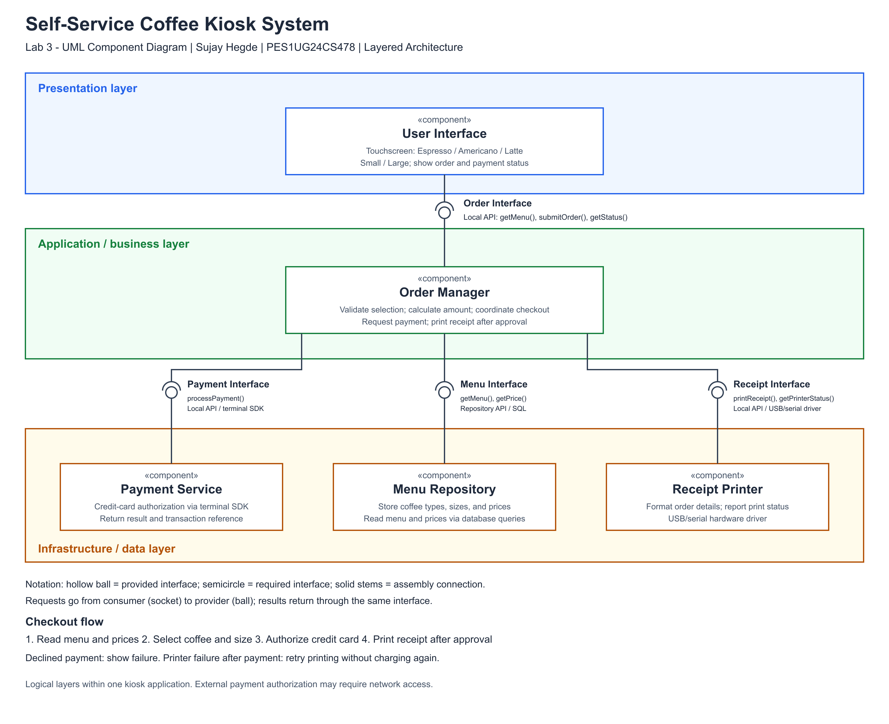

# Lab 3: Component Modelling & Architectural Pattern Selection

**Sujay Hegde | PES1UG24CS478**
**Scenario:** Self-Service Coffee Kiosk System
**Architecture:** Layered

| Deliverable | Files |
| --- | --- |
| UML component diagram | [PNG](Architecture_Diagram.png), [PDF](Architecture_Diagram.pdf) |
| Editable diagram | [draw.io](Architecture_Diagram.drawio), [SVG](Architecture_Diagram.svg) |
| One-page justification | [Word](Architecture_Justification_Document.docx), [PDF](Architecture_Justification_Document.pdf) |
| Detailed style comparison and contracts | [Markdown](Architecture_Specification.md), [PDF](Architecture_Specification.pdf) |



The five components are User Interface, Order Manager, Payment Service, Receipt Printer, and Menu Repository. The four assembly interfaces are Order, Payment, Receipt, and Menu. Each connects a consumer's required socket to a provider's hollow ball. Requests and results use the same interface.

Presentation, application/business, and infrastructure/data are logical layers within one kiosk application. Payment and Receipt components encapsulate hardware APIs. These boundaries make components replaceable; they do not imply separate processes or establish security certification or a measured response time.

## Rebuild the exports

Install Node.js 20 or newer. In this directory:

```powershell
npm ci
npm run generate
```

[generate_lab3_artifacts.mjs](generate_lab3_artifacts.mjs) generates draw.io, SVG, PNG, and PDF diagrams from one component/interface model. It produces Word and PDF justification from the same text and exports the specification PDF. Regenerating overwrites the exports; update the generator to keep all formats synchronized.
