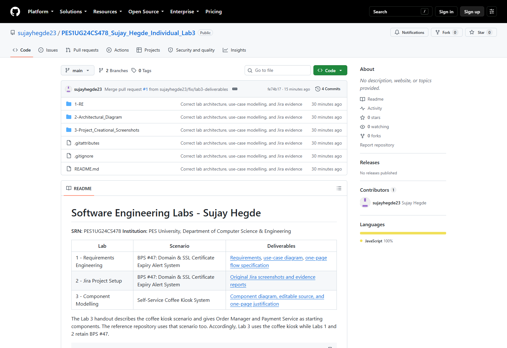
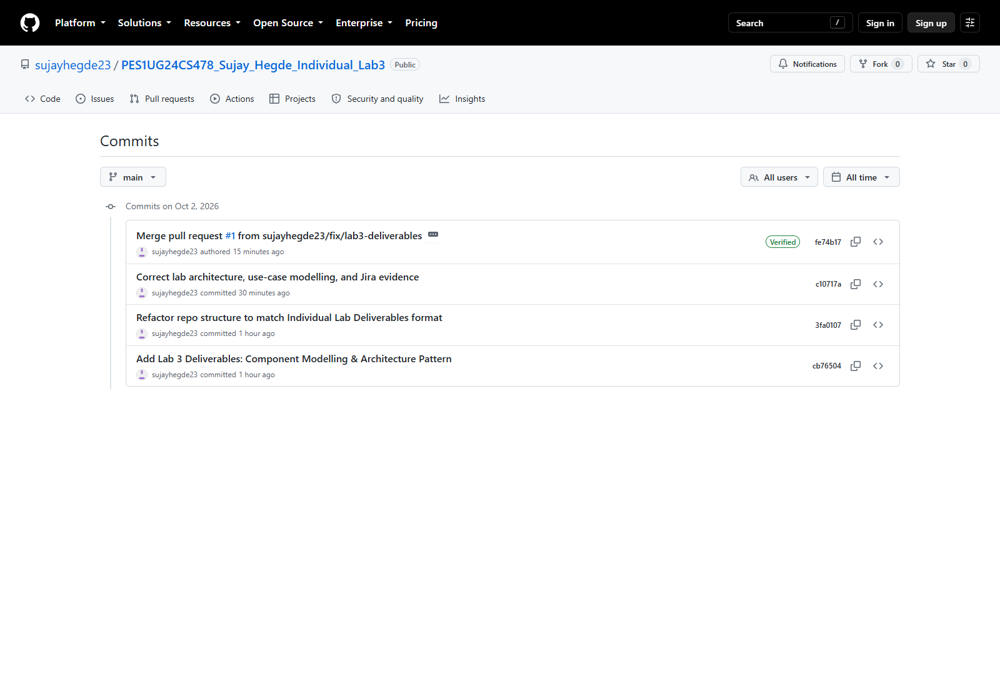

# GitHub Repository and History Screenshots

**Sujay Hegde | PES1UG24CS478**

Captured from the live public repository on 2 October 2026 in Chrome at 1600 x 1100 pixels. The temporary browser was signed out. Images preserve the actual GitHub page content; no repository or commit information was synthesized.

| Capture | File | Source |
| --- | --- | --- |
| Repository page with owner, name, folders, and README | [Repository screenshot](01_Repository_Page.png) | [Live repository](https://github.com/sujayhegde23/PES1UG24CS478_Sujay_Hegde_Individual_Lab3) |
| Main-branch commit history, including creation-era commits and merged corrections | [History screenshot](02_Commit_History.png) | [Commit history](https://github.com/sujayhegde23/PES1UG24CS478_Sujay_Hegde_Individual_Lab3/commits/main/) |

The repository capture shows the existing project, rather than the historical New Repository form. Captures reflect main at commit `fe74b17`, before the new RTM/SRS/WBS additions.

